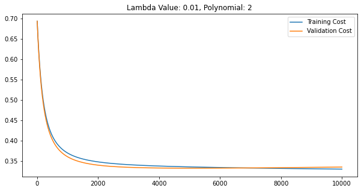

# Heart Disease Classification using Logistic Regression From Scratch

## Overview
This project aims to classify patients with heart disease using Logistic Regression. The model analyzes 11 patient features to predict the presence of heart disease. Key steps include data preprocessing, feature engineering, model selection with polynomial degrees and regularization, and evaluation on training, validation, and test datasets. The final model achieves **~87% accuracy** on unseen data.

> **Note:** This is a **from-scratch implementation**, meaning no pre-built libraries like TensorFlow or PyTorch were used for model training. 
---

## Dataset Details
- **Source**: [Heart Disease Dataset](https://www.kaggle.com/datasets/johnsmith88/heart-disease-dataset) (based on file `heart.csv`).
- **Features**: 11 attributes including age, sex, cholesterol levels, ECG results, and exercise-induced angina.
- **Labels**: Binary (`0` = no heart disease, `1` = heart disease).
- **Size**: 918 samples (508 patients with heart disease, 410 without).
- **Preprocessing**:
  1. Handling categorical features (e.g., `Sex`, `ChestPainType`) via integer encoding.
  2. Min-Max scaling to normalize features between `[-1, 1]`.
  3. Train-Validation-Test split (60%-20%-20%).

---

## Methodology
### 1. Data Preprocessing
1. **Data Wrangling**: Convert categorical strings (e.g., `M/F`, `ATA/NAP/ASY`) to integers.
2. **Feature Scaling**: Applied min-max normalization:
   
```math
\text{scaled\_value} = 2 \times \frac{\text{value} - \min}{\max - \min} - 1
```
   
3. **Dataset Split**: Randomized into training (60%), validation (20%), and test (20%).

### 2. Model Selection
1. **Polynomial Features**: Tested degrees 1–12. Selected **2nd degree** for balancing underfitting/overfitting.
2. **Regularization**: $$Evaluated \(\lambda\) values \(0, 0.01, 0.1, 1, 10, 100\). Optimal \(\lambda = 0.1\).$$
3. **Hypothesis Function**:
   
$$
h_\theta(x) = \theta_0 + \theta_1x_1 + \theta_2x_2 + \dots + \theta_{22}x_{11}^2
$$
   
### 3. Training
1. **Algorithm**: Gradient Descent with learning rate $$\(\alpha = 0.03\)$$.
2. **Iterations**: 10,000 epochs (early stopping at ~2,500 iterations based on validation loss).
3. **Cost Function**: Regularized logistic loss:
   
$$
J(\theta) = -\frac{1}{m} \sum \left[ y \log(h_\theta(x)) + (1-y) \log(1-h_\theta(x)) \right] + \frac{\lambda}{2m} \sum \theta_j^2
$$

---

## Results
| Dataset       | Accuracy | Error  |
|---------------|----------|--------|
| Training      | 87.45%   | 0.332  |
| Validation    | 85.33%   | 0.329  |
| Test          | 87.51%   | 0.341  |

- **Training Curve**:  
    
  *Cost decreases steadily, indicating effective learning.*

---

## Getting Started
### 1. Prerequisites
- Python 3.x
- Libraries: `numpy`, `pandas`, `matplotlib`, `seaborn`, `jupyter`

### 2. Installation
1. Clone the repository:
   ```bash
   git clone https://github.com/muhammad-abdullah-3272/Heart-Disease-Classification-Using-Logistic-Regression.git
   cd heart-disease-classification
   ```

## Usage

### 3. Training:
1. Run `Training.ipynb` to preprocess data, train the model, and save weights (`Weights.npy`, `Bias.npy`).
2. Adjust hyperparameters (e.g., `learning_rate`, `lambda`) in the notebook.

### 4. Prediction:
1. Use `Prediction.ipynb` to input patient features interactively:
   ```python
   # Example input format:
   Age: 45
   Sex (0=F, 1=M): 1
   ChestPainType (0-3): 2
   ...
   ```
2. The model outputs `1` (heart disease) or `0` (no heart disease).

### 5. Model Selection:
1. Explore `ModelSelection.ipynb` to test polynomial degrees and regularization parameters.

## Directory Structure

```
Project1/
├── Training/
│   ├── Training.ipynb       # Data preprocessing and model training
│   └── heart.csv            # Dataset
├── Prediction/
│   ├── Prediction.ipynb     # Interactive prediction script
│   └── Weights.npy          # Saved model parameters
├── ModelSelection/
│   └── ModelSelection.ipynb # Hyperparameter tuning
└── Misc/
    └── figures/             # Training plots and visualizations
```

## Conclusion

This logistic regression model effectively classifies heart disease with **87% accuracy**. Future improvements could include:

- Adding more features (e.g., genetic markers).
- Experimenting with advanced algorithms (e.g., Random Forests, Neural Networks).
- Collecting larger datasets to reduce variance.
